# Sistem POS & Akuntansi Toko (Kelompok 4)

Aplikasi POS dan akuntansi toko dengan 7 peran (RBAC): Owner, Kepala Toko, Bagian Keuangan, Akunting, Kepala Gudang, Kasir, dan Sales.

**Aplikasi online:** https://sistem-pos-rust.vercel.app

**Akun uji (password semua: 123):** owner, kepala, keuangan, akunting, gudang, kasir, sales

## Pembagian Tugas

| Anggota | NIM | Tugas | File yang dikerjakan |
|---|---|---|---|
## Pembagian Tugas

| Anggota | NIM | Tugas | File yang dikerjakan |
| Dewan | 240131009 | Login, hak akses (RBAC), sidebar, dan beranda | AuthContext.jsx, menu.js, ProtectedRoute.jsx, Sidebar.jsx, Login.jsx, Beranda.jsx |

| Fakhri | 240131002 | Order Sales, POS Kasir, pengajuan diskon dan void | Order.jsx, Pos.jsx |

| Falah | 240131019 | Inventori Gudang (penerimaan, opname, kartu stok, hapus buku) dan persetujuan Kepala Toko | Gudang.jsx, Persetujuan.jsx |

| Hasan | 2401 | Jurnal akuntansi, rekonsiliasi persediaan, dan laporan keuangan | Jurnal.jsx, Laporan.jsx |

| Rival | 240131025 | Data pusat dan jurnal otomatis, deployment (GitHub dan Vercel), README, dan dokumen perancangan | store.jsx, README.md, docs/, vercel.json |

### Halaman Login
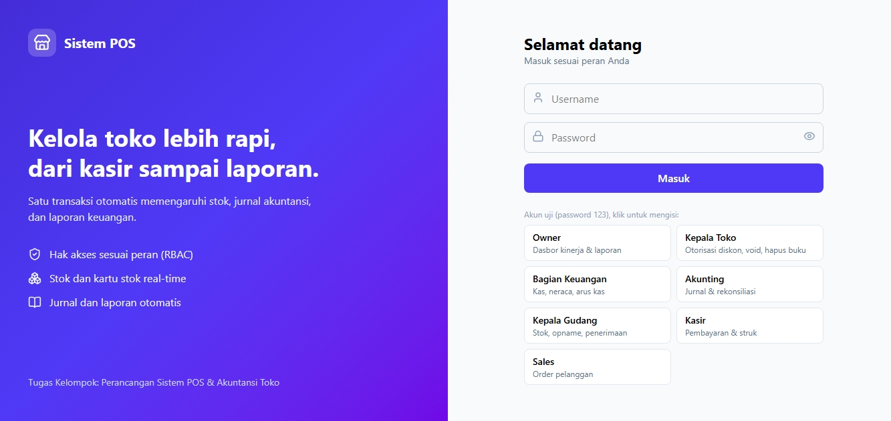

### Beranda
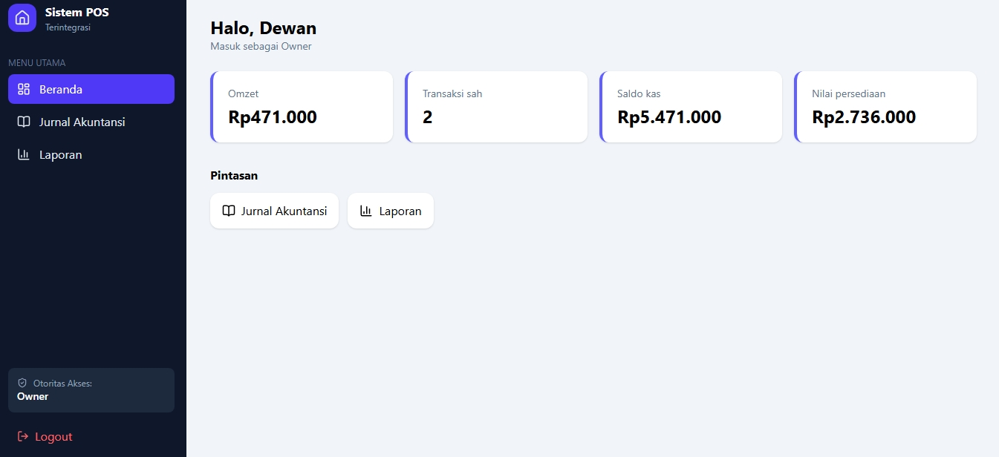

### Order Pelanggan (Sales)
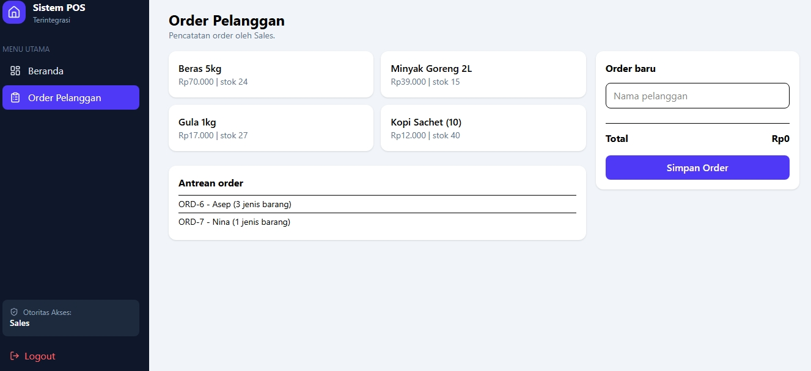

### Transaksi & POS (Kasir)
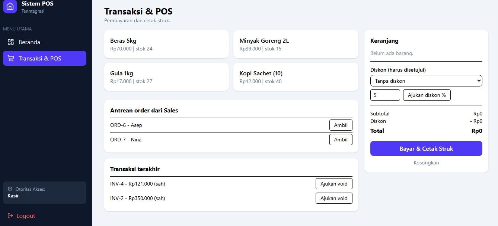

### Persetujuan dan Penerimaan (Kepala Toko)
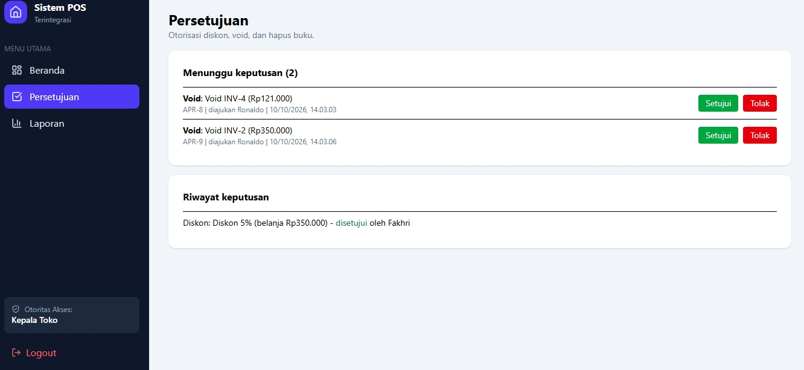

### Inventori Gudang
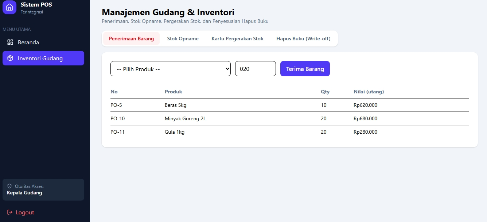
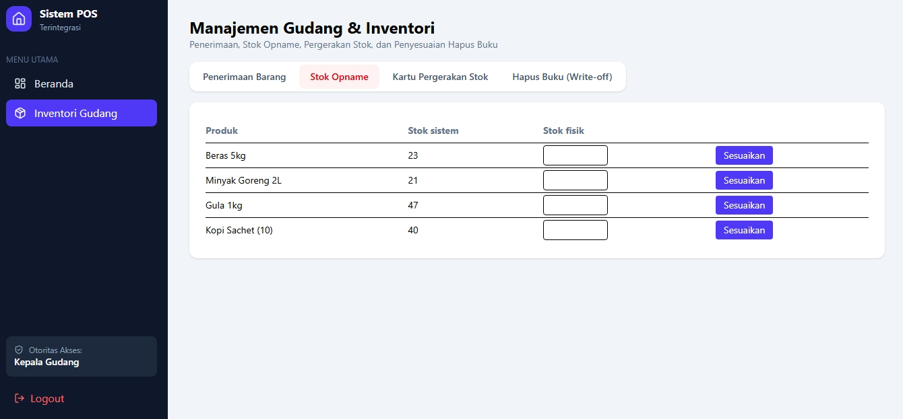
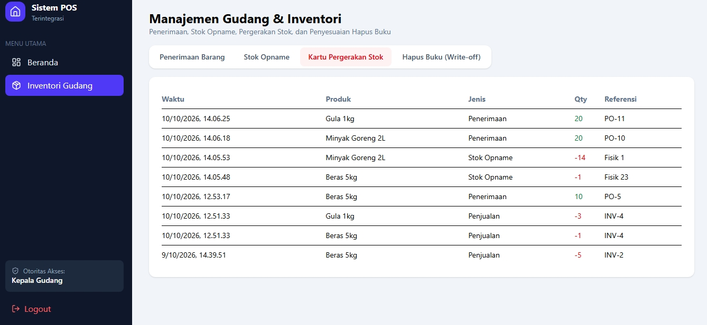
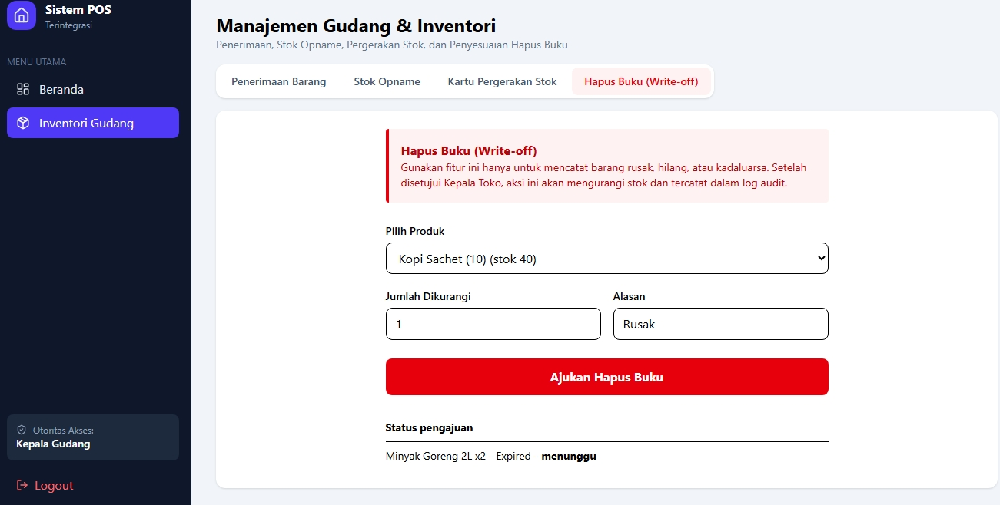

### Jurnal Akuntansi
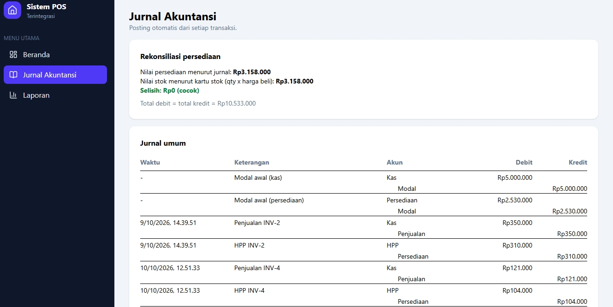

### Laporan
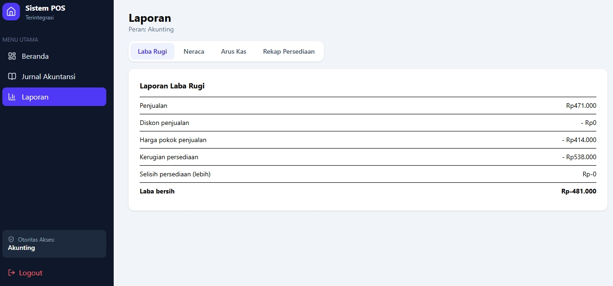
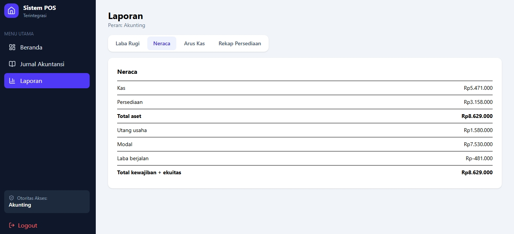
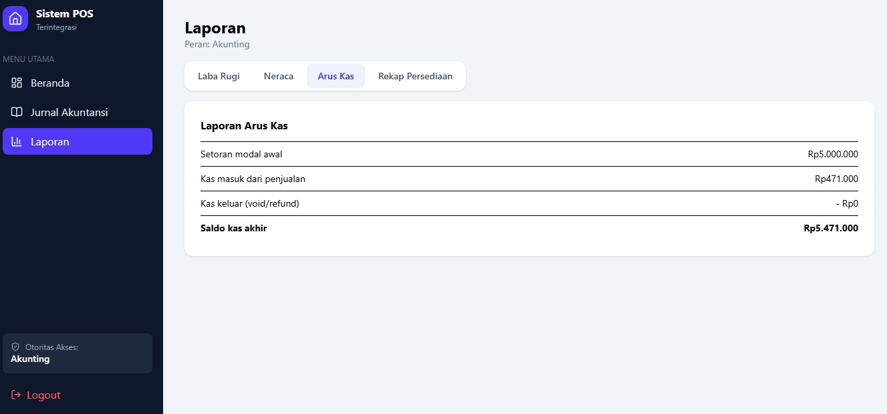
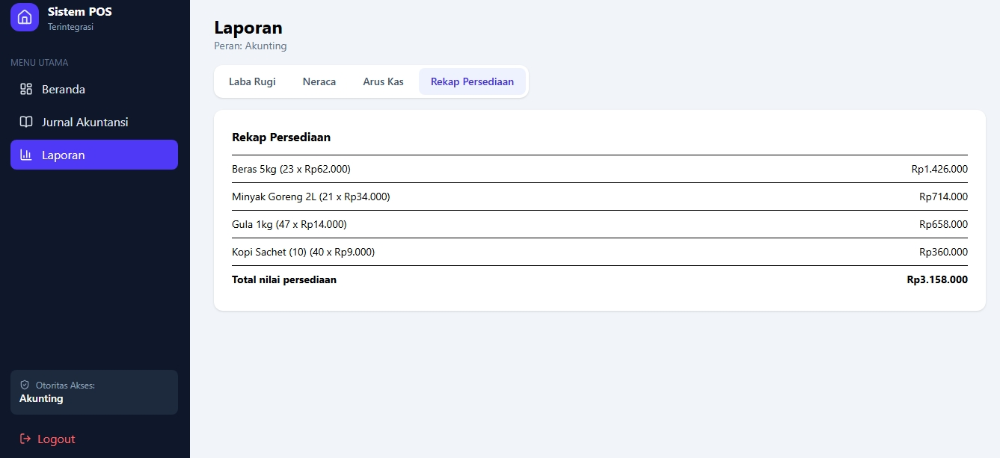

## Fitur Utama
- Hak akses per peran (RBAC)
- Order Sales, pembayaran Kasir, dan persetujuan diskon, void, hapus buku oleh Kepala Toko
- Penerimaan barang, stok opname, dan kartu stok
- Jurnal otomatis dan rekonsiliasi persediaan
- Laporan penjualan, persediaan, laba rugi, neraca, dan arus kas

## Cara Menjalankan
Jalankan `npm install`, lalu `npm run dev`, kemudian buka http://localhost:5173

## Teknologi
React, Vite, Tailwind CSS, React Router